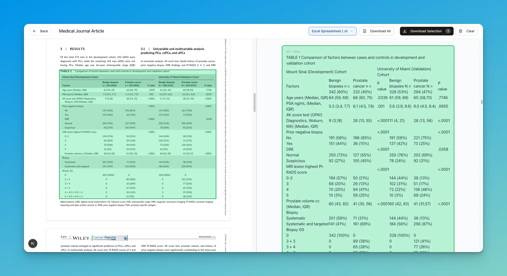
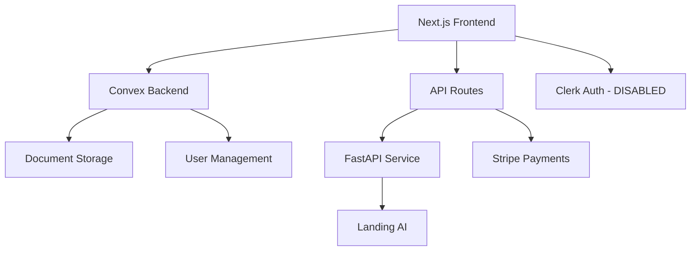

# Precision PDF



**AI-powered PDF data extraction tool with visual verification and confidence**

Precision PDF is an open-source document processing platform that extracts structured data from PDFs while showing you exactly where every piece of data comes from. Built with Next.js 15, Convex, and Clerk authentication.

## ✨ Key Features

- 🔍 **Visual Data Verification** - See exactly where extracted data comes from in the original PDF
- ⚡ **Real-time Processing** - Live updates as documents are processed
- 📊 **Smart Table Recognition** - Automatic table detection and CSV export
- 📄 **Multiple Export Formats** - JSON, CSV, DOCX, Markdown, Text, XLSX
- 🏥 **Document Type Support** - Invoices, medical records, bank statements, forms
- 📱 **Multi-page Documents** - Handle complex documents with multiple pages
- 🔌 **API Access** - Full REST API for developers
- 🎯 **Interactive Demo** - Try 8 real examples without signing up

## 🚨 Security Notice (Important for Developers)

**This repository is currently configured for easy local development with ALL AUTHENTICATION AND SECURITY FEATURES DISABLED.**

For production deployment, you MUST:
- Re-enable authentication in `middleware.ts`
- Configure all environment variables properly
- Follow the [Security Configuration Guide](./docs/security/re-enabling-auth.md)

See [Security Documentation](./docs/security/) for complete details.

## 🚀 Quick Start

### Prerequisites

- Node.js (Latest LTS recommended)
- pnpm package manager
- Convex CLI (`npm install -g convex`)

### 5-Minute Setup

```bash
# Clone the repository
git clone https://github.com/yourusername/precision-pdf.git
cd precision-pdf

# Install dependencies
pnpm install

# Set up environment variables
cp .env.example .env.local

# Initialize Convex (creates a new deployment)
npx convex dev

# Start the development server
pnpm run dev
```

Your app will be running at `http://localhost:3000`

> **Note**: The FastAPI processing service is optional for local development. Example documents work without it.

## 🏗 Architecture Overview



**Core Components:**
- **Frontend**: Next.js 15 with App Router and Tailwind CSS
- **Backend**: Convex for real-time database and serverless functions
- **Authentication**: Clerk (currently disabled for local development)
- **Processing**: External FastAPI service with Landing AI
- **Payments**: Stripe integration
- **UI Components**: shadcn/ui component library

## 📚 Documentation

### For Developers

| Topic | Description | Link |
|-------|-------------|------|
| **Getting Started** | Complete setup guide | [📖 Getting Started](./docs/developers/01-quick-start.md) |
| **Security Config** | ⚠️ Critical: Auth setup | [🔐 Security Guide](./docs/developers/04-security-configuration.md) |
| **Architecture** | System design & diagrams | [🏗 Architecture](./docs/developers/architecture-overview.md) |
| **API Reference** | All endpoints & examples | [📡 API Docs](./docs/developers/api-reference.md) |
| **Components** | UI components & styling | [🎨 Components](./docs/developers/component-library.md) |
| **Testing** | Writing & running tests | [🧪 Testing](./docs/developers/testing-guide.md) |
| **Deployment** | Production deployment | [🚀 Deployment](./docs/developers/deployment-guide.md) |

### For End Users

| Topic | Description | Link |
|-------|-------------|------|
| **Getting Started** | How to use the app | [👤 User Guide](./docs/users/getting-started.md) |
| **Uploading Documents** | PDF upload process | [📄 Upload Guide](./docs/users/uploading-documents.md) |
| **Export Formats** | Available export options | [💾 Export Guide](./docs/users/exporting-data.md) |
| **Troubleshooting** | Common issues | [🔧 Troubleshooting](./docs/users/troubleshooting.md) |

### API Integration

| Resource | Description | Link |
|----------|-------------|------|
| **curl Examples** | Command-line usage | [💻 curl Examples](./docs/examples/curl-examples.md) |
| **JavaScript SDK** | JS/TS integration | [⚛️ JavaScript](./docs/examples/javascript-sdk.md) |
| **Python Examples** | Python integration | [🐍 Python](./docs/examples/python-examples.md) |

## 🛠 Development Commands

```bash
# Start development servers (both frontend and backend)
pnpm run dev

# Run only frontend (Next.js)
pnpm run dev:frontend

# Run only backend (Convex)
pnpm run dev:backend

# Build for production
pnpm run build

# Run tests
pnpm run test              # Unit tests with Vitest
pnpm run pw:test          # E2E tests with Playwright
pnpm run pw:test:ui       # Playwright UI mode

# Linting and formatting
pnpm run lint
```

## 🌍 Environment Variables

Copy `.env.example` to `.env.local` and configure:

```bash
# Core Services (Required)
NEXT_PUBLIC_CONVEX_URL="https://your-deployment.convex.cloud"
NEXT_PUBLIC_APP_URL="http://localhost:3000"

# Authentication (Clerk) - Currently disabled
NEXT_PUBLIC_CLERK_PUBLISHABLE_KEY="pk_test_your-clerk-key"
CLERK_SECRET_KEY="sk_test_your-clerk-secret"

# Document Processing (Optional for local dev)
FAST_API_URL="http://localhost:8000"
FAST_API_SECRET_KEY="your-secret-key"

# Payments (Stripe) - Optional for local dev
STRIPE_PUBLISHABLE_KEY="pk_test_your-stripe-key"
STRIPE_SECRET_KEY="sk_test_your-stripe-secret"
```

See [Environment Variables Guide](./docs/developers/environment-variables.md) for complete reference.

## 🔌 External Dependencies

### Required Services

1. **Convex** - Backend database and serverless functions
   - Sign up at [convex.dev](https://convex.dev)
   - Free tier available

2. **FastAPI Service** (Optional for local development)
   - Repository: [precision_pdf_fast_api](https://github.com/robertguss/precision_pdf_fast_api)
   - Handles PDF processing with Landing AI
   - Can run locally or deploy to Render

### Optional Services (For production)

3. **Clerk** - Authentication (currently disabled)
4. **Stripe** - Payment processing
5. **Landing AI** - Document processing AI
6. **Sentry** - Error monitoring

## 🧪 Testing

The project includes comprehensive testing infrastructure:

```bash
# Unit Tests (Vitest)
pnpm run test          # Run once
pnpm run test:watch    # Watch mode
pnpm run test:ui       # UI interface

# E2E Tests (Playwright)
pnpm run pw:test       # Headless
pnpm run pw:test:ui    # UI mode
pnpm run pw:test:debug # Debug mode
```

Currently no tests are implemented, but infrastructure is ready. See [Testing Guide](./docs/developers/testing-guide.md).

## 📦 Tech Stack

### Frontend
- **Next.js 15** - React framework with App Router
- **React 19** - UI library
- **Tailwind CSS** - Utility-first styling
- **shadcn/ui** - Component library
- **TypeScript** - Type safety

### Backend
- **Convex** - Real-time database and serverless functions
- **Clerk** - Authentication (currently disabled)
- **Stripe** - Payment processing

### External Services
- **FastAPI** - Document processing service
- **Landing AI** - AI-powered document extraction

### DevOps & Monitoring
- **Vercel** - Frontend hosting
- **Render** - FastAPI hosting
- **Sentry** - Error monitoring
- **PostHog** - Analytics

## 📄 Example Documents

The app includes 8 pre-processed example documents:

- 📧 Invoice
- 🏦 Bank Statements (2)
- 🏥 Medical Reports (2)
- 📑 Medical Journal Article
- 🏠 Mortgage Application
- 📋 Settlement Statement

Examples are stored in `/public/examples/` and can be explored without authentication.

## 🤝 Contributing

We welcome contributions! Please see our [Contributing Guide](./docs/contributing/CONTRIBUTING.md) for details on:

- Code style and standards
- Development workflow
- Pull request process
- Issue reporting

### Quick Contribution Setup

```bash
# Fork the repo and clone your fork
git clone https://github.com/yourusername/precision-pdf.git

# Create a feature branch
git checkout -b feature/your-feature-name

# Make your changes and test
pnpm run test
pnpm run lint

# Submit a pull request
```

## 🐛 Troubleshooting

### Common Issues

**"User not authenticated" errors in development:**
- This is expected since authentication is disabled
- Check the security configuration guide

**Documents not processing:**
- Ensure FastAPI service is running
- Check environment variable configuration
- See [Troubleshooting Guide](./docs/users/troubleshooting.md)

**Build errors:**
- Ensure you're using the latest Node.js LTS
- Delete `node_modules` and run `pnpm install`

## 📊 Project Status

- ✅ Core document processing
- ✅ Visual verification interface
- ✅ Multiple export formats
- ✅ Real-time processing updates
- ⚠️ Authentication (disabled for local dev)
- ⚠️ Testing (infrastructure ready)
- 🔄 Documentation (in progress)

## 📜 License

This project is open source. License details coming soon.

## 🆘 Support

- **Documentation**: Browse `/docs` folder
- **Issues**: [GitHub Issues](https://github.com/yourusername/precision-pdf/issues)
- **Discussions**: [GitHub Discussions](https://github.com/yourusername/precision-pdf/discussions)

## 📞 Contact

For questions about this project:
- **GitHub**: [@robertguss](https://github.com/robertguss)
- **Website**: [precisionpdf.com](https://precisionpdf.com)

---

⭐ **Star this repository if you find it useful!** ⭐