# Architecture Overview

Precision PDF is built as a modern, distributed system with real-time capabilities and AI-powered document processing. This document provides a comprehensive overview of the system architecture.

## High-Level System Architecture

```mermaid
graph TB
    User[👤 User]
    Browser[🌐 Browser]
    
    subgraph "Frontend Layer"
        NextJS[⚛️ Next.js 15<br/>App Router]
        UI[🎨 shadcn/ui<br/>Tailwind CSS]
        Auth[🔐 Clerk Auth<br/>Currently Disabled]
    end
    
    subgraph "API Layer"
        APIRoutes[📡 API Routes<br/>/app/api/*]
        Middleware[🛡️ Middleware<br/>Auth Disabled]
    end
    
    subgraph "Backend Layer"
        Convex[⚡ Convex<br/>Real-time DB + Functions]
        Storage[💾 Convex Storage<br/>File Management]
    end
    
    subgraph "External Services"
        FastAPI[🐍 FastAPI Service<br/>PDF Processing]
        LandingAI[🤖 Landing AI<br/>Document Extraction]
        Stripe[💳 Stripe<br/>Payments]
    end
    
    subgraph "Monitoring & Analytics"
        Sentry[🚨 Sentry<br/>Error Tracking]
        PostHog[📊 PostHog<br/>Analytics]
        Crisp[💬 Crisp<br/>Support Chat]
    end
    
    User --> Browser
    Browser --> NextJS
    NextJS --> UI
    NextJS --> Auth
    NextJS --> APIRoutes
    APIRoutes --> Middleware
    APIRoutes --> Convex
    APIRoutes --> FastAPI
    Convex --> Storage
    FastAPI --> LandingAI
    NextJS --> Stripe
    Browser --> Sentry
    Browser --> PostHog
    Browser --> Crisp
```



## Component Architecture

### Frontend Architecture

```mermaid
graph TD
    subgraph "Next.js App Structure"
        Layout[📄 app/layout.tsx<br/>Root Layout + Providers]
        
        subgraph "Marketing Pages"
            Home[🏠 app/page.tsx<br/>Landing Page]
            Demo[🎯 app/demo/*<br/>Interactive Demo]
            Legal[📜 app/(marketing)/*<br/>Privacy, Terms]
        end
        
        subgraph "Dashboard App"
            DashLayout[📱 app/dashboard/layout.tsx<br/>Authenticated Layout]
            DashHome[🏡 app/dashboard/page.tsx<br/>Dashboard Home]
            Upload[📤 app/dashboard/components/UploadPage.tsx<br/>File Upload]
            Viewer[👁️ app/dashboard/components/DocumentViewer.tsx<br/>PDF + Data Viewer]
            Processing[⏳ app/dashboard/components/ProcessingView.tsx<br/>Real-time Status]
        end
    end
    
    subgraph "Shared Components"
        UILib[🎨 components/ui/*<br/>shadcn/ui Components]
        Marketing[📢 components/marketing/*<br/>Landing Page Components]
        Providers[🔌 components/ConvexClientProvider.tsx<br/>Real-time Connection]
    end
    
    Layout --> Home
    Layout --> Demo
    Layout --> Legal
    Layout --> DashLayout
    DashLayout --> DashHome
    DashLayout --> Upload
    DashLayout --> Viewer
    DashLayout --> Processing
    
    Home --> Marketing
    Upload --> UILib
    Viewer --> UILib
    Layout --> Providers
```

### Backend Architecture (Convex)

```mermaid
graph TB
    subgraph "Convex Backend"
        Schema[📋 schema.ts<br/>Database Schema]
        
        subgraph "Core Functions"
            Documents[📄 documents.ts<br/>Document CRUD + Processing]
            Users[👤 users.ts<br/>User Management]
            Subs[💳 subscriptions.ts<br/>Billing + Usage]
            Plans[📊 plans.ts<br/>Plan Management]
        end
        
        subgraph "External Integrations"
            HTTPRoutes[🌐 http.ts<br/>HTTP Actions]
            StripeInteg[💰 stripe.ts<br/>Payment Webhooks]
        end
        
        subgraph "Authentication"
            AuthConfig[🔐 auth.config.ts<br/>Clerk Integration]
        end
    end
    
    subgraph "Database Tables"
        UsersTable[(👥 users)]
        DocsTable[(📄 documents)]
        SubsTable[(💳 subscriptions)]
        PlansTable[(📊 plans)]
        UsageTable[(📈 pageUsage)]
    end
    
    Schema --> UsersTable
    Schema --> DocsTable
    Schema --> SubsTable
    Schema --> PlansTable
    Schema --> UsageTable
    
    Documents --> DocsTable
    Users --> UsersTable
    Subs --> SubsTable
    Plans --> PlansTable
    Subs --> UsageTable
```



## Data Flow Diagrams

### Document Processing Flow


### Authentication Flow (When Enabled)


### Export Flow


### Real-time Updates


## Database Schema

### Core Tables


## Technology Stack Deep Dive

### Frontend Technologies

| Technology | Version | Purpose | Notes |
|------------|---------|---------|--------|
| **Next.js** | 15.2.3 | React framework | App Router, SSR, API routes |
| **React** | 19.0.0 | UI library | Latest with concurrent features |
| **TypeScript** | 5.x | Type safety | Strict mode enabled |
| **Tailwind CSS** | 4.1.8 | Styling | Utility-first CSS |
| **shadcn/ui** | Latest | Component library | Radix UI based |
| **Lucide React** | 0.513.0 | Icons | Consistent icon system |

### Backend Technologies

| Technology | Version | Purpose | Notes |
|------------|---------|---------|--------|
| **Convex** | 1.23.0 | Backend-as-a-Service | Real-time DB + serverless functions |
| **Clerk** | 6.12.6 | Authentication | Currently disabled for dev |
| **Stripe** | 18.2.1 | Payment processing | Subscription management |

### External Services

| Service | Purpose | Status |
|---------|---------|--------|
| **FastAPI** | PDF processing | External service |
| **Landing AI** | Document extraction | AI processing |
| **Sentry** | Error monitoring | Optional |
| **PostHog** | Analytics | Optional |
| **Crisp** | Customer support | Optional |

### Development Tools

| Tool | Purpose | Configuration |
|------|---------|---------------|
| **Vitest** | Unit testing | Ready but no tests |
| **Playwright** | E2E testing | Multi-browser setup |
| **ESLint** | Code linting | Next.js config |
| **Prettier** | Code formatting | Configured |
| **pnpm** | Package management | Workspace support |

## Security Architecture (Currently Disabled)

### Authentication Flow (When Enabled)



```mermaid
graph TB
    subgraph "Browser"
        User[👤 User]
        ClerkUI[🔐 Clerk Components]
    end
    
    subgraph "Next.js"
        Middleware[🛡️ Middleware<br/>Route Protection]
        APIAuth[🔒 API Route Auth]
        Pages[📱 Protected Pages]
    end
    
    subgraph "Clerk Service"
        ClerkAuth[🏢 Clerk Backend]
        JWT[🎫 JWT Tokens]
    end
    
    subgraph "Convex"
        ConvexAuth[⚡ Convex Auth]
        Functions[📝 Protected Functions]
    end
    
    User --> ClerkUI
    ClerkUI <--> ClerkAuth
    ClerkAuth --> JWT
    JWT --> Middleware
    Middleware --> Pages
    JWT --> APIAuth
    JWT --> ConvexAuth
    ConvexAuth --> Functions
```

### Security Layers

1. **Frontend Protection**
   - Route-based authentication
   - Component-level access control
   - Session management

2. **API Security**
   - JWT token validation
   - Rate limiting (when enabled)
   - CORS configuration

3. **Database Security**
   - Row-level security via user context
   - Function-level authorization
   - Real-time subscription filtering

## Performance Considerations

### Optimization Strategies

1. **Frontend Performance**
   - Next.js App Router for optimal loading
   - Image optimization with Next.js Image
   - Component lazy loading
   - React 19 concurrent features

2. **Backend Performance**
   - Convex real-time queries (no polling)
   - Efficient data indexing
   - Serverless function optimization

3. **File Handling**
   - Progressive upload for large files
   - Convex Storage for scalable file management
   - Image serving optimization

### Scalability Design

1. **Horizontal Scaling**
   - Stateless API design
   - Convex auto-scaling
   - CDN for static assets

2. **Database Optimization**
   - Proper indexing strategy
   - Query optimization
   - Real-time subscription efficiency

## Deployment Architecture

### Development Environment

```mermaid
graph TB
    Dev[👩‍💻 Developer]
    
    subgraph "Local Machine"
        Local[🏠 localhost:3000<br/>Next.js Dev Server]
        ConvexDev[⚡ Convex Dev<br/>Local Functions]
        FastAPIDev[🐍 FastAPI<br/>localhost:8000]
    end
    
    subgraph "Convex Cloud"
        ConvexDB[(📊 Dev Database)]
        ConvexStorage[(💾 Dev Storage)]
    end
    
    Dev --> Local
    Local --> ConvexDev
    Local --> FastAPIDev
    ConvexDev --> ConvexDB
    ConvexDev --> ConvexStorage
```



### Production Environment

```mermaid
graph TB
    Users[👥 Users]
    
    subgraph "Vercel"
        NextProd[⚛️ Next.js<br/>Production App]
        APIRoutes[📡 API Routes<br/>Serverless Functions]
    end
    
    subgraph "Convex Cloud"
        ConvexProd[⚡ Convex<br/>Production Backend]
        ProdDB[(📊 Production DB)]
        ProdStorage[(💾 Production Storage)]
    end
    
    subgraph "Render"
        FastAPIProd[🐍 FastAPI<br/>Production Service]
    end
    
    subgraph "External Services"
        ClerkProd[🔐 Clerk]
        StripeProd[💳 Stripe]
        LandingAIProd[🤖 Landing AI]
    end
    
    Users --> NextProd
    NextProd --> APIRoutes
    APIRoutes --> ConvexProd
    APIRoutes --> FastAPIProd
    ConvexProd --> ProdDB
    ConvexProd --> ProdStorage
    NextProd --> ClerkProd
    APIRoutes --> StripeProd
    FastAPIProd --> LandingAIProd
```



## API Architecture

### RESTful API Design

```mermaid
graph TB
    subgraph "API Routes (/app/api/*)"
        Upload[📤 /upload-document<br/>POST - Upload PDF]
        Process[⚙️ /process-document<br/>POST - Process with AI]
        
        subgraph "Export APIs"
            ExportJSON[📄 /export/json<br/>GET - JSON format]
            ExportCSV[📊 /export/csv<br/>GET - CSV format]
            ExportDOCX[📝 /export/docx<br/>GET - Word document]
            ExportAll[📦 /export/all-*<br/>GET - Bulk exports]
        end
        
        Examples[🎯 /examples/load<br/>GET - Demo documents]
        Images[🖼️ /documents/[id]/page-image/[page]<br/>GET - Page images]
        Test[🔧 /test<br/>GET - Health check]
    end
    
    subgraph "Convex Functions"
        Queries[🔍 Queries<br/>Read operations]
        Mutations[✏️ Mutations<br/>Write operations]
        Actions[⚡ Actions<br/>External API calls]
    end
    
    Upload --> Mutations
    Process --> Actions
    ExportJSON --> Actions
    ExportCSV --> Actions
    ExportDOCX --> Actions
    ExportAll --> Actions
    Examples --> Queries
    Images --> Queries
```

## Error Handling & Monitoring

### Error Flow

```mermaid
graph TB
    subgraph "Error Sources"
        FrontendError[🐛 Frontend Errors]
        APIError[⚠️ API Errors]
        ConvexError[💥 Convex Errors]
        FastAPIError[🚨 FastAPI Errors]
    end
    
    subgraph "Error Handling"
        ErrorBoundary[🛡️ React Error Boundary]
        APIHandler[🔧 API Error Handler]
        ConvexHandler[⚡ Convex Error Handler]
    end
    
    subgraph "Monitoring"
        Sentry[🚨 Sentry<br/>Error Tracking]
        Logs[📝 Console Logs]
        UserFeedback[💬 User Feedback]
    end
    
    FrontendError --> ErrorBoundary
    APIError --> APIHandler
    ConvexError --> ConvexHandler
    FastAPIError --> APIHandler
    
    ErrorBoundary --> Sentry
    APIHandler --> Sentry
    ConvexHandler --> Sentry
    
    ErrorBoundary --> Logs
    APIHandler --> Logs
    ConvexHandler --> Logs
    
    ErrorBoundary --> UserFeedback
```



## Next Steps

- **[API Reference](./api-reference.md)** - Detailed API documentation
- **[Database Schema](./database-schema.md)** - Complete schema reference  
- **[Security Guide](../security/re-enabling-auth.md)** - Re-enabling authentication
- **[Deployment Guide](./deployment-guide.md)** - Production deployment