# Security Overview

Comprehensive security documentation for Precision PDF, covering current status, security architecture, and compliance features.

## 🚨 Current Security Status

### ⚠️ Development Mode - Security Disabled

**CRITICAL WARNING:** This repository is currently configured for local development with **ALL SECURITY FEATURES DISABLED**.

#### What's Currently Disabled:
- ❌ **Authentication middleware** - No login required
- ❌ **API authentication** - All endpoints are public
- ❌ **User authorization** - No ownership checks
- ❌ **Rate limiting** - No request limits
- ❌ **CORS restrictions** - Allows all origins
- ❌ **Webhook validation** - Signatures not verified
- ❌ **Input validation** - Minimal validation
- ❌ **Security headers** - Basic headers only

#### For Production Deployment:
**You MUST follow the [Re-enabling Authentication Guide](./re-enabling-auth.md) before production deployment.**

## 🏗 Security Architecture (When Enabled)

### Multi-Layer Security Model

```mermaid
graph TB
    User[👤 User] 
    
    subgraph "Frontend Security"
        Browser[🌐 Browser]
        CSP[🛡️ Content Security Policy]
        HTTPS[🔒 HTTPS/TLS]
    end
    
    subgraph "Application Security"  
        Middleware[🚪 Auth Middleware]
        RateLimit[⏱️ Rate Limiting]
        CORS[🌍 CORS Policy]
    end
    
    subgraph "API Security"
        JWTAuth[🎫 JWT Authentication]
        APIValidation[✅ Input Validation]
        Authorization[🔐 Authorization Checks]
    end
    
    subgraph "Data Security"
        Encryption[🔐 Data Encryption]
        Convex[⚡ Convex Security]
        FileStorage[💾 Secure File Storage]
    end
    
    subgraph "External Security"
        Clerk[👥 Clerk Auth Service]
        Stripe[💳 Stripe PCI Compliance]
        FastAPI[🐍 FastAPI Service Security]
    end
    
    User --> Browser
    Browser --> CSP
    Browser --> HTTPS
    HTTPS --> Middleware
    Middleware --> RateLimit
    Middleware --> CORS
    CORS --> JWTAuth
    JWTAuth --> APIValidation
    APIValidation --> Authorization
    Authorization --> Encryption
    Encryption --> Convex
    Encryption --> FileStorage
    
    JWTAuth <--> Clerk
    APIValidation <--> Stripe
    FileStorage <--> FastAPI
```



## 🔐 Authentication & Authorization

### Authentication Flow (When Enabled)


### Authorization Model

#### Role-Based Access Control
```typescript
enum UserRole {
  FREE = 'free',
  PRO = 'pro',
  ADMIN = 'admin'
}

interface User {
  id: string
  role: UserRole
  permissions: Permission[]
}

interface Permission {
  resource: 'document' | 'export' | 'admin'
  action: 'create' | 'read' | 'update' | 'delete'
  scope: 'own' | 'team' | 'all'
}
```

#### Resource Ownership
- Users can only access their own documents
- Document ownership validated on every API call
- File access restricted by user ID
- Export permissions based on document ownership

### API Security Headers

```typescript
// Security headers (when enabled)
const securityHeaders = {
  'X-Frame-Options': 'SAMEORIGIN',
  'X-Content-Type-Options': 'nosniff', 
  'X-XSS-Protection': '1; mode=block',
  'Referrer-Policy': 'origin-when-cross-origin',
  'Permissions-Policy': 'camera=(), microphone=(), geolocation=()',
  'Content-Security-Policy': `
    default-src 'self';
    script-src 'self' 'unsafe-eval' 'unsafe-inline' *.clerk.com *.stripe.com;
    style-src 'self' 'unsafe-inline' *.clerk.com;
    img-src 'self' blob: data: *.clerk.com *.convex.cloud;
    connect-src 'self' *.clerk.com *.convex.cloud *.stripe.com;
    frame-src 'self' *.clerk.com *.stripe.com;
  `
}
```

## 🛡️ Data Protection

### Data Encryption

#### At Rest
- **Convex Storage**: AES-256 encryption for all stored files
- **Database**: Encrypted at rest by Convex infrastructure
- **Secrets**: Environment variables encrypted in deployment platforms

#### In Transit
- **HTTPS/TLS 1.3**: All API communications encrypted
- **WebSocket Security**: Secure connections to Convex real-time services
- **Third-party APIs**: Encrypted connections to Clerk, Stripe, FastAPI

### Data Handling Policies

#### Personal Data
```typescript
interface PersonalDataPolicy {
  collection: {
    minimal: true // Only collect necessary data
    explicit_consent: true
    purpose_limitation: true
  }
  
  storage: {
    encryption: 'AES-256'
    retention_period: '30_days_post_processing'
    geographic_restrictions: ['US', 'EU']
  }
  
  access: {
    user_owned_only: true
    admin_access: 'audit_logged'
    third_party: 'none'
  }
}
```

#### Document Processing Data
- **Temporary Processing**: Files deleted after 24 hours
- **Extracted Data**: Retained based on user plan
- **Page Images**: Cached for performance, deleted with document
- **Processing Logs**: Anonymized and retained for 90 days

### Privacy by Design

1. **Data Minimization**: Only collect and process necessary data
2. **Purpose Limitation**: Data used only for stated purposes  
3. **Transparency**: Clear privacy policy and data practices
4. **User Control**: Users can download and delete their data
5. **Secure Defaults**: Privacy-protective defaults

## 🔒 File Security

### Upload Security

```typescript
interface FileSecurityPolicy {
  validation: {
    file_types: ['application/pdf']
    max_size: 50 * 1024 * 1024 // 50MB
    malware_scan: true
    content_validation: true
  }
  
  storage: {
    virus_scan: true
    encryption: 'AES-256'
    access_control: 'user_only'
    backup: 'encrypted'
  }
  
  processing: {
    sandboxed: true
    timeout: 300 // 5 minutes max
    resource_limits: true
    audit_logging: true
  }
}
```

### Content Security
- **Malware Scanning**: Files scanned before processing
- **Content Validation**: PDF structure validation
- **Sandboxed Processing**: Processing in isolated environments
- **Access Logging**: All file access logged and monitored

## 🚧 Input Validation & Sanitization

### API Input Validation

```typescript
// Example validation schema
const uploadValidation = {
  file: {
    required: true,
    type: 'file',
    mimeTypes: ['application/pdf'],
    maxSize: 50 * 1024 * 1024
  },
  
  metadata: {
    title: {
      type: 'string',
      maxLength: 255,
      sanitize: true
    }
  }
}

// SQL Injection Prevention
// Using Convex's typed queries prevents SQL injection
const getDocument = query({
  args: { documentId: v.id("documents") },
  handler: async (ctx, { documentId }) => {
    // Type-safe, injection-proof query
    return await ctx.db.get(documentId)
  }
})
```

### XSS Prevention
- **Content Sanitization**: All user inputs sanitized
- **CSP Headers**: Strict Content Security Policy
- **Output Encoding**: All dynamic content properly encoded
- **Template Security**: React's built-in XSS protection

### CSRF Protection
- **SameSite Cookies**: CSRF protection for session cookies
- **JWT Tokens**: Stateless authentication reduces CSRF risk
- **Origin Validation**: API requests validate origin headers

## 🔐 Secrets Management

### Environment Variables Security

```bash
# Production secrets management
# Never commit these to version control

# Authentication secrets
CLERK_SECRET_KEY="sk_live_..."
JWT_SIGNING_SECRET="$(openssl rand -base64 64)"
SESSION_SECRET="$(openssl rand -base64 32)"

# API keys
STRIPE_SECRET_KEY="sk_live_..."
LANDING_AI_API_KEY="..."
FAST_API_SECRET_KEY="$(openssl rand -base64 32)"

# Webhook secrets  
CLERK_WEBHOOK_SECRET="whsec_..."
STRIPE_WEBHOOK_SECRET="whsec_..."

# Encryption keys
ENCRYPTION_KEY="$(openssl rand -base64 32)"
DATABASE_ENCRYPTION_KEY="$(openssl rand -base64 64)"
```

### Secret Rotation Policy
- **API Keys**: Rotate every 90 days
- **Webhook Secrets**: Rotate every 180 days  
- **Encryption Keys**: Rotate annually
- **JWT Secrets**: Rotate every 30 days in production

## 🌍 Network Security

### CORS Configuration

```typescript
// Production CORS policy
const corsConfig = {
  origin: [
    'https://precisionpdf.com',
    'https://www.precisionpdf.com'
  ],
  credentials: true,
  methods: ['GET', 'POST', 'PUT', 'DELETE'],
  allowedHeaders: [
    'Authorization',
    'Content-Type',
    'X-Requested-With'
  ],
  maxAge: 86400 // 24 hours
}
```

### Rate Limiting

```typescript
// Rate limiting configuration
const rateLimits = {
  upload: {
    windowMs: 60 * 60 * 1000, // 1 hour
    max: 50, // 50 uploads per hour
    skipSuccessfulRequests: false
  },
  
  api: {
    windowMs: 15 * 60 * 1000, // 15 minutes
    max: 1000, // 1000 requests per 15 minutes
    skipFailedRequests: true
  },
  
  export: {
    windowMs: 60 * 60 * 1000, // 1 hour  
    max: 100, // 100 exports per hour
    skipSuccessfulRequests: false
  }
}
```

### DDoS Protection
- **Rate Limiting**: Prevents abuse via request limits
- **Cloudflare**: CDN provides DDoS protection (when configured)
- **Resource Limits**: Processing timeouts prevent resource exhaustion
- **Monitoring**: Alert on unusual traffic patterns

## 🔍 Monitoring & Audit

### Security Monitoring

```typescript
interface SecurityEvent {
  timestamp: number
  event_type: 'auth_failure' | 'suspicious_activity' | 'data_access' | 'admin_action'
  user_id?: string
  ip_address: string
  user_agent: string
  details: Record<string, any>
  severity: 'low' | 'medium' | 'high' | 'critical'
}
```

### Audit Logging
- **Authentication Events**: All login/logout attempts
- **Data Access**: Document views, downloads, exports
- **Admin Actions**: User management, system changes
- **Security Events**: Failed authentication, suspicious activity
- **API Usage**: All API calls with user context

### Alerting & Response
- **Failed Authentication**: Alert after 5 failed attempts
- **Unusual Activity**: Large file uploads, bulk exports
- **System Errors**: 5xx responses, service outages
- **Security Incidents**: Automated incident response

## 🏥 Compliance Features

### HIPAA Compliance

#### Technical Safeguards
- **Access Control**: Role-based authentication
- **Audit Controls**: Comprehensive logging
- **Integrity**: Data integrity checks
- **Person Authentication**: Multi-factor authentication support
- **Transmission Security**: End-to-end encryption

#### Administrative Safeguards
- **Security Officer**: Designated security administrator
- **Training**: Security awareness for team members
- **Incident Response**: Documented procedures
- **Risk Assessment**: Regular security assessments

#### Physical Safeguards
- **Cloud Infrastructure**: Convex and Vercel compliance
- **Workstation Security**: Secure development environments
- **Media Controls**: Secure data storage and disposal

### SOC 2 Type I Compliance

#### Security
- **Firewalls**: Network security controls
- **Intrusion Detection**: Monitoring for threats
- **Multi-factor Authentication**: Enhanced access security

#### Availability  
- **System Monitoring**: 24/7 uptime monitoring
- **Incident Response**: Rapid response to outages
- **Disaster Recovery**: Data backup and recovery procedures

#### Processing Integrity
- **Data Validation**: Input validation and sanitization
- **Error Handling**: Comprehensive error management
- **Quality Assurance**: Testing and code review

#### Confidentiality
- **Data Encryption**: At rest and in transit
- **Access Controls**: Restricted data access
- **Non-disclosure**: Confidentiality agreements

#### Privacy
- **Data Collection**: Minimal data collection
- **User Rights**: Access, correction, deletion rights
- **Consent Management**: Clear consent mechanisms

### GDPR Compliance

#### Lawful Basis
- **Consent**: Explicit consent for data processing
- **Contract**: Processing necessary for service delivery
- **Legitimate Interest**: Security and fraud prevention

#### Data Subject Rights
- **Right to Access**: Data export functionality
- **Right to Rectification**: Account management tools
- **Right to Erasure**: Account deletion capabilities
- **Right to Portability**: Data export in standard formats
- **Right to Object**: Opt-out mechanisms

#### Data Protection by Design
- **Privacy by Default**: Minimal data collection
- **Data Minimization**: Only necessary data processing
- **Purpose Limitation**: Clear processing purposes
- **Storage Limitation**: Time-limited data retention

## 🚨 Incident Response

### Security Incident Categories

1. **Critical**: Data breach, system compromise
2. **High**: Service disruption, authentication bypass
3. **Medium**: Failed authentication attempts, suspicious activity
4. **Low**: Policy violations, minor vulnerabilities

### Response Procedures

#### Immediate Response (0-1 hours)
1. **Assessment**: Determine incident scope and impact
2. **Containment**: Isolate affected systems
3. **Notification**: Alert security team and stakeholders
4. **Documentation**: Begin incident log

#### Short-term Response (1-24 hours)
1. **Investigation**: Analyze logs and evidence
2. **Mitigation**: Implement temporary fixes
3. **Communication**: Update stakeholders
4. **Evidence Preservation**: Secure forensic data

#### Long-term Response (1-30 days)
1. **Resolution**: Implement permanent fixes
2. **Recovery**: Restore normal operations
3. **Lessons Learned**: Document improvements
4. **Policy Updates**: Update security procedures

### Breach Notification
- **Internal Notification**: Immediate team alert
- **Customer Notification**: Within 72 hours if required
- **Regulatory Notification**: GDPR, HIPAA compliance
- **Public Disclosure**: If legally required

## 🔧 Security Testing

### Vulnerability Assessment

```typescript
// Automated security scanning
const securityChecks = {
  dependencies: {
    tool: 'npm audit',
    frequency: 'daily',
    auto_fix: 'minor_versions'
  },
  
  static_analysis: {
    tool: 'ESLint Security Plugin',
    frequency: 'on_commit',
    block_deployment: true
  },
  
  container_scanning: {
    tool: 'Docker Scout',
    frequency: 'on_build',
    fail_threshold: 'high'
  }
}
```

### Penetration Testing
- **Annual Testing**: Professional security assessment
- **Scope**: Web application, API endpoints, infrastructure
- **Remediation**: Fix critical/high vulnerabilities within 30 days
- **Reporting**: Detailed findings and recommendations

### Security Code Review
- **Pull Request Reviews**: Security-focused code review
- **Threat Modeling**: Design-phase security analysis
- **Secure Coding Standards**: Development guidelines
- **Security Training**: Regular team education

## 📋 Security Checklist

### Pre-Production Security Review

#### Authentication & Authorization
- [ ] Authentication re-enabled in middleware
- [ ] API route authentication uncommented  
- [ ] JWT validation configured correctly
- [ ] User authorization checks implemented
- [ ] Role-based access control working

#### Data Protection
- [ ] HTTPS enforced for all connections
- [ ] Database encryption enabled
- [ ] File storage encryption configured
- [ ] Sensitive data properly masked in logs
- [ ] Data retention policies implemented

#### Input Validation
- [ ] All user inputs validated and sanitized
- [ ] File upload restrictions enforced
- [ ] SQL injection protection verified
- [ ] XSS protection implemented
- [ ] CSRF protection enabled

#### Infrastructure Security
- [ ] Security headers configured
- [ ] CORS policies restrictive
- [ ] Rate limiting enabled
- [ ] Monitoring and alerting active
- [ ] Secrets properly managed

#### Compliance
- [ ] Privacy policy published
- [ ] Terms of service updated
- [ ] GDPR compliance verified
- [ ] HIPAA safeguards (if applicable)
- [ ] Audit logging enabled

## 🚀 Security Roadmap

### Phase 1: Foundation (Complete before production)
- ✅ Re-enable authentication system
- ✅ Implement comprehensive input validation
- ✅ Configure security headers and CORS
- ✅ Set up monitoring and alerting
- ✅ Establish incident response procedures

### Phase 2: Enhanced Security (Post-launch)
- [ ] Implement multi-factor authentication
- [ ] Add advanced threat detection
- [ ] Enhanced audit logging and analytics
- [ ] Security automation and orchestration
- [ ] Regular penetration testing

### Phase 3: Advanced Features (Future)
- [ ] Zero-trust architecture
- [ ] Advanced AI threat detection
- [ ] Automated compliance reporting
- [ ] Security analytics dashboard
- [ ] Bug bounty program

---

## Next Steps

1. **[Re-enable Authentication](./re-enabling-auth.md)** - Critical first step
2. **[Deployment Guide](../developers/deployment-guide.md)** - Secure deployment
3. **[Compliance Documentation](./compliance.md)** - Detailed compliance info
4. **[Contributing Guide](../contributing/CONTRIBUTING.md)** - Security-focused contributions

**Remember: Security is not optional. Follow the re-enablement guide before any production deployment.**