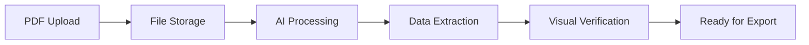

# User Guide: Getting Started

Welcome to Precision PDF! This guide will help you extract structured data from your PDF documents with visual verification.

## What is Precision PDF?

Precision PDF is an AI-powered document processing tool that:

- 🔍 **Extracts data** from PDFs with high accuracy
- 👁️ **Shows you exactly where** each piece of data comes from
- 📊 **Recognizes tables, forms, and structured content**
- 💾 **Exports to multiple formats** (CSV, JSON, Word, Excel, etc.)
- ⚡ **Processes documents in real-time** with live updates

## Try the Interactive Demo

Before creating an account, explore our interactive demo with 8 real-world examples:

1. Visit the homepage
2. Click "Try Interactive Demo"
3. Explore pre-processed documents:
   - 📧 Invoice
   - 🏦 Bank Statements
   - 🏥 Medical Reports
   - 📑 Research Papers
   - 🏠 Mortgage Applications

## Creating an Account

Currently, the app is in development mode with authentication disabled, so you can use it without signing up. In production, you would:

1. Click "Sign Up" in the top right
2. Choose your preferred sign-up method
3. Verify your email address
4. Start with the free plan (10 pages)

## Uploading Your First Document

### Supported File Types

- **PDF files only** (for now)
- **Maximum size**: 50MB per file
- **Multi-page documents**: Fully supported
- **Languages**: English (primary), with limited support for other languages

### Upload Process

1. **Navigate to Dashboard**
   - Click "Upload Document" or go to `/dashboard`

2. **Choose Your File**
   - Drag and drop a PDF file
   - Or click "Browse" to select from your computer
   - The file will upload immediately

3. **Processing Begins**
   - You'll see a real-time progress indicator
   - Processing typically takes 30-60 seconds per page
   - Status updates happen automatically

4. **Review Results**
   - Once complete, you'll see the extracted data
   - Compare it with the original PDF side-by-side

### What Happens During Processing



1. **File Storage**: Your PDF is securely stored
2. **AI Processing**: Advanced AI analyzes the document structure
3. **Data Extraction**: Text, tables, and forms are identified
4. **Visual Verification**: Each piece of data is linked to its source location
5. **Ready for Export**: Choose your preferred output format

## Understanding Your Results

### The Document Viewer Interface

When processing completes, you'll see:

#### Left Panel: Original PDF
- **Page navigation**: Click through pages
- **Zoom controls**: Magnify details
- **Highlighted regions**: See where data was extracted from

#### Right Panel: Extracted Data
- **Markdown view**: Clean, structured text representation
- **Chunk view**: Individual data pieces with source locations
- **Table data**: Structured tables ready for export

#### Visual Verification
- **Click any data chunk** to see its location in the original PDF
- **Bounding boxes** show exactly where text was found
- **Color coding** indicates different types of content

### Data Quality Indicators

- ✅ **High Confidence**: Clear, well-extracted data
- ⚠️ **Medium Confidence**: May need review
- ❌ **Low Confidence**: Requires manual verification

### Types of Extracted Content

| Content Type | Description | Example |
|--------------|-------------|---------|
| **Text Blocks** | Paragraphs and sentences | Contract terms, descriptions |
| **Tables** | Structured data in rows/columns | Financial data, inventories |
| **Forms** | Field-value pairs | Name: John Doe, Date: 2024-01-01 |
| **Headers** | Document titles and section headers | Invoice #12345, Patient Information |
| **Lists** | Bullet points and numbered lists | Terms and conditions, requirements |

## Exporting Your Data

### Available Export Formats

#### For Spreadsheet Use
- **CSV**: Perfect for Excel, Google Sheets
- **XLSX**: Native Excel format with formatting

#### For Developers
- **JSON**: Structured data with metadata
- **API access**: Programmatic integration

#### For Documentation
- **Markdown**: Clean, readable format
- **DOCX**: Microsoft Word document
- **Plain Text**: Simple text extraction

### How to Export

1. **Single Document Export**
   - Open any processed document
   - Click "Export" button
   - Choose your preferred format
   - File downloads automatically

2. **Bulk Export**
   - Go to document list
   - Click "Export All"
   - Select format (JSON, CSV, etc.)
   - Download ZIP archive with all documents

### Export Examples

#### CSV Export (Great for Spreadsheets)
```csv
Field,Value,Page,Confidence
Company Name,Acme Corp,1,0.98
Invoice Number,INV-001,1,0.95
Amount,$1234.56,1,0.99
```

#### JSON Export (Perfect for Developers)
```json
{
  "title": "Invoice INV-001",
  "pageCount": 2,
  "extractedData": {
    "company": "Acme Corp",
    "amount": "$1234.56",
    "items": [...]
  },
  "chunks": [...]
}
```

## Best Practices for Great Results

### Document Quality Tips

✅ **Good Documents**:
- High resolution scans (300 DPI+)
- Clear, readable text
- Standard fonts and layouts
- Well-structured tables

❌ **Challenging Documents**:
- Blurry or low-resolution scans
- Handwritten text
- Complex multi-column layouts
- Heavy graphics overlaying text

### Upload Recommendations

1. **Optimize Your PDFs**
   - Use "Save as PDF" instead of scanning when possible
   - Ensure text is selectable (not just an image)
   - Remove unnecessary pages

2. **For Scanned Documents**
   - Scan at 300 DPI or higher
   - Use black and white for text documents
   - Ensure pages are straight and well-lit

3. **File Organization**
   - Use descriptive filenames
   - Group related documents
   - Process similar document types together

## Understanding Your Account

### Free Plan Limits
- **10 pages per month**
- **All export formats**
- **Visual verification**
- **Basic support**

### Usage Tracking
- Monitor your page usage in the dashboard
- Counts reset monthly
- Multi-page documents count each page separately

### Upgrade Benefits
- **More pages per month**
- **Priority processing**
- **Advanced features**
- **Priority support**

## Common Use Cases

### 📊 Business Documents
- **Invoices**: Extract line items, totals, vendor info
- **Financial Statements**: Pull key figures and ratios
- **Contracts**: Identify key terms and dates
- **Reports**: Convert tables to spreadsheet format

### 🏥 Healthcare Documents
- **Medical Records**: Extract patient information and test results
- **Lab Reports**: Convert test data to structured format
- **Insurance Forms**: Pull policy and claim information
- **Research Papers**: Extract data tables and findings

### 🏦 Financial Documents
- **Bank Statements**: Extract transaction data
- **Tax Documents**: Pull income and deduction information
- **Investment Reports**: Convert performance data
- **Loan Applications**: Extract applicant information

### 📚 Academic & Research
- **Research Papers**: Extract data tables and citations
- **Thesis Documents**: Convert appendices and data
- **Grant Applications**: Pull budget and timeline information
- **Survey Results**: Convert response data

## Troubleshooting Common Issues

### Upload Problems

**Problem**: "File upload failed"
- ✅ Check file size (max 50MB)
- ✅ Ensure it's a PDF file
- ✅ Try refreshing the page
- ✅ Check your internet connection

**Problem**: "File type not supported"
- ✅ Convert to PDF first
- ✅ Ensure file extension is .pdf

### Processing Issues

**Problem**: "Processing failed"
- ✅ Try re-uploading the document
- ✅ Check if the PDF has selectable text
- ✅ Contact support with the document

**Problem**: "Poor extraction quality"
- ✅ Check original document quality
- ✅ Try a higher resolution scan
- ✅ Ensure text is not in images

### Export Problems

**Problem**: "Export failed" or "No data to export"
- ✅ Ensure document processing completed successfully
- ✅ Try refreshing the page
- ✅ Try a different export format

**Problem**: "Missing data in export"
- ✅ Check if data was extracted (visible in viewer)
- ✅ Some formats may not include all metadata
- ✅ Try JSON export for complete data

## Getting Help

### Self-Service Resources
- 📚 **Documentation**: Browse all guides in `/docs`
- 🎯 **Interactive Demo**: Try examples without uploading
- 🔍 **FAQ**: Common questions and answers

### Contact Support
- 💬 **Live Chat**: Click the chat widget (bottom right)
- 📧 **Email**: support@precisionpdf.com
- 🐛 **Bug Reports**: GitHub Issues for technical problems

### Feature Requests
- Have an idea for improvement?
- Want support for new document types?
- Contact us through any support channel

## What's Next?

### Explore Advanced Features
- **API Integration**: Automate document processing
- **Bulk Processing**: Handle multiple documents
- **Custom Workflows**: Integrate with your systems

### Stay Updated
- **Follow Updates**: Watch for new features
- **Join Community**: Connect with other users
- **Provide Feedback**: Help us improve

---

Ready to start extracting data from your PDFs? **[Upload your first document →](http://localhost:3000/dashboard)**